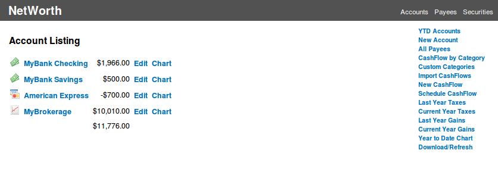

NetWorth
========

This is a Rails 3.2 application for recording Bank and Investment account
transactions.  Briefly, it supports the following features:

- basic bookkeeping of transactions (CashFlows) by Account
- scheduling of re-occuring CashFlows which are automatically recorded
- view CashFlows by Payee and Category
- importing from institutions that support OFX download
- handles Investment accounts and recording Stock trades
- attempts to track Captial Gains
- Income Tax category tracking and can do a basic calculation of income taxes
- some Charting capability using ProtoChart (javascript)

This was mainly written out of personal interest in learning the Rails
framework and out of some early frustration with the Quicken product for Mac.

Screenshot of Account listing page:

If you have rubygems installed, this can be started with:
*  bundle install
*  rake db:migrate\_all
*  ./script/production   # starts with empty database
or:
*  ./script/demo         # starts with demo database

The code was written in bits and pieces over the years. Much of the codebase
here is overdue to be refactored or rewritten, but is mostly stable.  It might
be too fragile for general use as your own bookkeeping solution, although it
does currently serve as mine.
Feel free to contact me if you find this project interesting to you.

Copyright © 2010-2014 Brian Welty <pacificbrian@zoho.com>
Released under the GPLv3 license, see LICENSE for more information.
